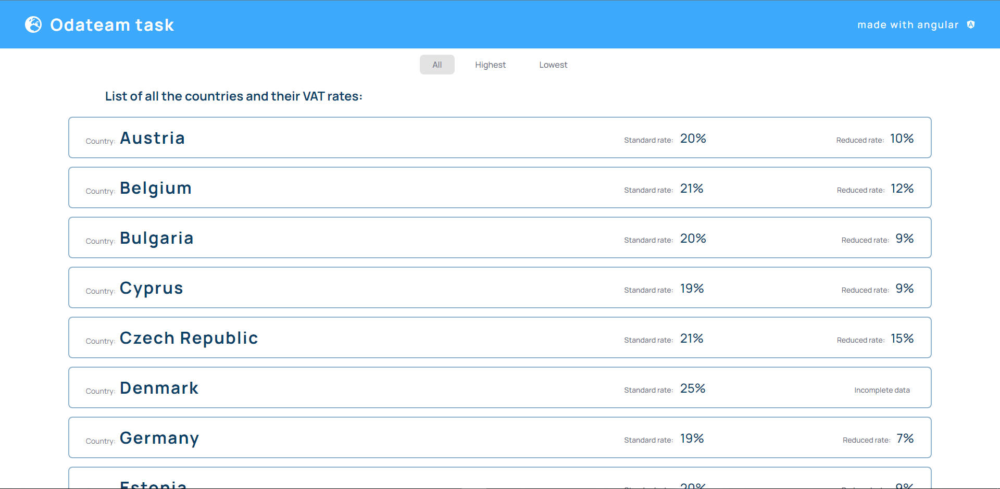
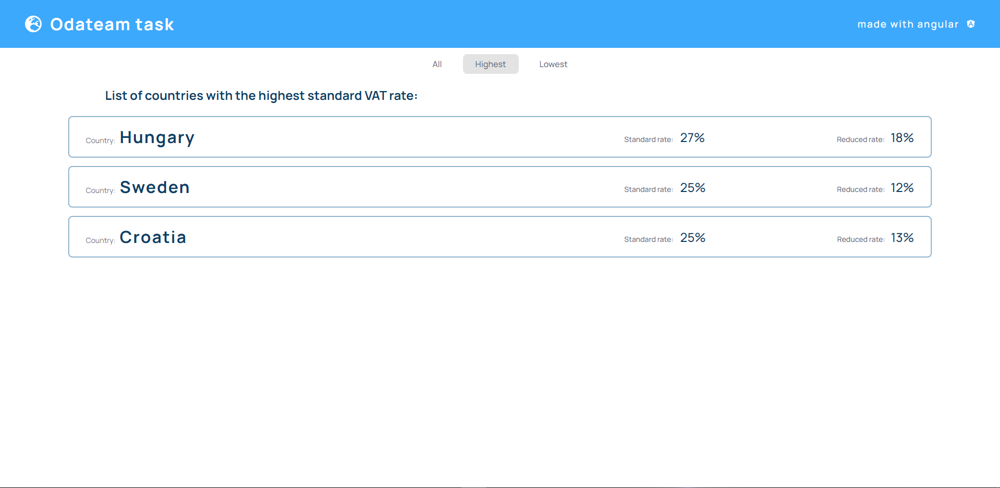
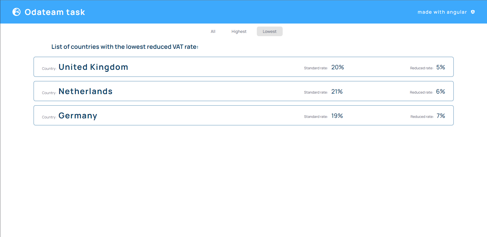

# Odateam task

## Instructions

Build a microservice which exposes a REST API for:
- Return three EU countries with the highest standard VAT rate
- Return three EU countries with the lowest reduced VAT rates

Input: https://euvatrates.com/rates.json

Guidelines: Keep it clean and simple (with some design for future extensions).
Implement as a Maven project using Spring Boot or Quarkus.
Provide source code, a way to run it and some kind documentation for the API.

Also build a simple UI using Angular to consume the API.

## [Backend solution](backend/README.md)

## Frontend

